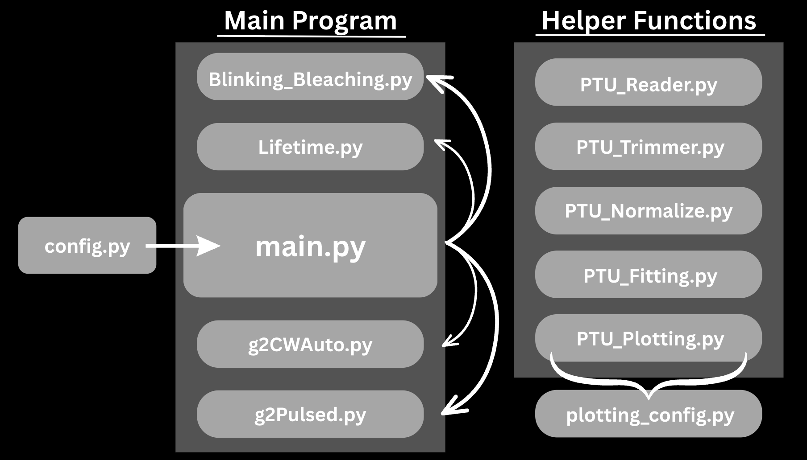

> [!CAUTION] This is a new but incomplete version of the program. Please proceed with caution and report any errors to Jaden Chilimigras at jchilim1@umbc.edu

# Pelton Research Repository

This repository was designed as a user friendly option when analyzing data from the PicoQuant system in both T2 and T3 mode. This repository can be used to perform normalization, fitting, and data analysis on output files from the PicoQuant system to help build a more comprehensive understanding of the properties and stability of quantum emitters.

The program is able to extract the header information and the data from all the different measurement modes (TCSPC and TTTR). From the given data and information from the header (or defined by the user) the program can normalize the data and perform a fitting (with residuals) of lifetime, g2 pulsed, and g2 CW Autocorrelation measurements. If specified by the user, the program is able to perform a blinking analysis (creating the intensity vs. experiment time plots and applying a threshold) of the data.

Note that the g2 normalization and T2 mode are still being tested with experimental data and the program's ability to handle background files is still being worked on (for now just leave parameters relating to the background file as they are). 

Please see the resources folder for Matlab code provided by PicoQuant as a reference for the file format of the .ptu files specifically for the PicoHarp data system.

### Differences between T2 and T3 mode

Both modes measure different things and are advantageous for certain measurements. These modes are different compared to the classical TCSPC (histogramming mode). Both modes are contained are a type of TTTR mode which allows accessing the arrival time of each single event with respect to the overall experiment time.

In T2 mode no periodic sync is required. Therefore, the sync input can be used to connect an additional photon detector. T2 mode is mainly used to make any kind of coincidence detection such as coincidence counting and correlations for antibunching in a HBT setup. T2 mode records two specific pieces of information:

- the elapsed time since the start of the measurements
- the channel at which the event has been detected

T3 mode is advantageous for performing measurements at very high synchronization rates. T3 mode is mainly used to make any kind of photoluminesence lifetime imaging and flourescence correlation spectroscopy measurements. T3 mode records three specific peices of information:

- the start-stop time difference 
- the number of elapsed sync pulses since measurement start
- the channel at which the event has been detected

See the brochure in the Resources folder and PicoHarp 300 manual for more information on T2 and T3 mode.

## How to use

To perform any sort of data analysis on any set of data collected from the PicoHarp 300 you enter the following command into the terminal:

```py
python main.py --ifile [paste file path here] --oname [output filename here]
```

This command will run the program with the default program settings that can be changed in the config file and save its output with the filename you gave on the command line. If you are using the program for the first time you will need to paste the file path to your background measurement into the config file and initialize the config parameters before you run the main program.

Currently, the program does not take any user inputs beside the initial command. In the future there will be options to perform specific data analysis functions that will be chosen by the user's input.

If you forget this initial command you can always enter the following command into the terminal:

```py
python main.py --help
```

which will show you the command structure with help messages.

## Understanding the structure of the program

This is a simple overview of the structure of the program for a more detailed explanation please see the README file in the Resources folder. Understanding how this program is structured is quite simple, there are really only three things you need to know about how the program works overall. 

First, we have the config files which will be the files you interact with the most beside running the actual program. In these files you will find a set of variables that you will need to define and adjust so that the program runs smoothly; you can think of the config files as the control center of the program. Currently, there are only two config files one can be found in this directory and the other inside the Functions folder. However, it is likely that you will not be interacting with the one inside the Functions folder as it controls the colors, labels, and titles of your plots. Hopefully you will not need to meddle with that file too much, but if you ever want to change how things look or how they are named that is the file for you. The other config file you will be interacting with a lot so it is best to get familiar with all the parameters and what they do. There is information on the parameters themselves and any defining conventions within the file itself, but if you want a more in depth understanding of everything found within that file I suggest reading the next section of this README. It is extermely important that you keep the parameters found there up to date with each file you analyze as neglecting to do so can throw some errors your way. 

Second, we have the main program which I consider to include all the Python files in this main directory. Each file is named so that you have a vague understanding as to what it might do the one exception being main.py. You can think of main.py as the overarching hub of the whole program. It is here where the program sends data to the other functions in this directory to perform the corresponding data analysis and collect these results and compile them into the output files. Each of the other files focuses on executing normalizations, fittings, and generating plots with residuals for each kind of measurement. 

Finally, we have the helper functions which essentially handle all the ``small'' tasks which can all be found inside the Functions folder. These files are where the code that *actually* lives within the program. You can think of everything in the main program as calling all the *right* helper functions for their given measurement, but the helper functions is where the code is actually being executed. 

Below is a visual of all the basic structure of the program:



Hopefully, that all made sense. If not, that's okay it's not extremely important for you to understand the structure of the program if you are only using it. However, if you have been tasked to debug this program hopefully this general description of the structure gives you a roadmap to find those pesky little bugs (of course you can always reference the README in the Resources folder if you get stuck too).

## Config File

The config file can be thought of as the control panel for the program. There are many different variables that you will see on this file. Whenever you go to analyze any dataset it is important to  ensure the settings in the config file are consistent with the measurements made. 

One of the most important variables that you should pay attention to is the MeasurementType variable. This variable can take on four different integer values, ranging from 0 to 3, each of which correspond to a specfic kind of measurement. Here's what each value means:

- 0: No specific measurement was made for the data set. The program will then only plot the raw data and perform no normalization or fitting of the data.
- 1: A lifetime measurement was made for the data set. The program will proceed to normalized and fit the data. It will then plot the fits and their respective residuals.
- 2: A g2 CW Autocorrelation measurement was made for the data set. The program will proceed to fit the data and plot its fit and the residuals.
- 3: A g2 Pulsed measurement was made for the data set. The program will proceed to fit the data and plot its fit and the residuals.

There are a few other variables that you will need to define before setting any variables specific to a measurement type. These variables are:

- trimming_threshold
- bin_width_ps
- time_window_ns
- background measurement file information

#### trimming_threshold

The trimming threshold controls a few things that depend on the kind of measurement made by the user. If the MeasurementType variable is set to no measurement type selected then this variable will have no impact on your output. If a MeasurementType is set to some value you have two possibilities:

1. If the MeasurementType is set to either a lifetime measurement or g2 CW Autocorrelation then the trimming_threshold parameter will essentially cut off any excess data points. In a lifetime or CW Autocorrelation measurement this looks like trimming the flat end of your data consequentially allowing you to focus on the decay/dip of the TCSPC data.

2. If the MeasurementType is set to a g2 pulsed measurement then this parameter will cut off the data at that specific index. This means that for a g2 pulsed measurement you want to make this variable fairly large to be able to see a few of the pulses. 

Note that the main difference between these two possibilities is that the trimming_threshold parameter is treated as an index that directly cuts off the data at said index and the other is a required threshold that must be satisfied before the data gets cut. 

#### bin_width_ps & time_window_ns

These two parameters are largely important for the histogramming of the TCSPC data - this will be relevant for T2 and T3 mode. The bin width defines how large you want the time bins to be. It is important that you select a time bin that is not too small (otherwise the data will look noisy) and not too big (otherwise )

#### Background measurement file information


****************************


